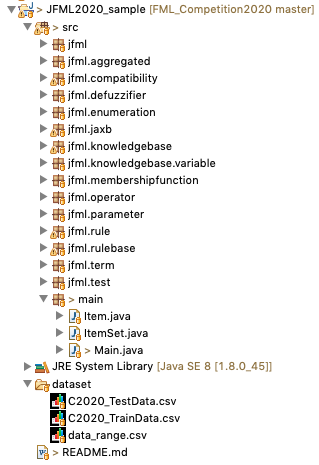
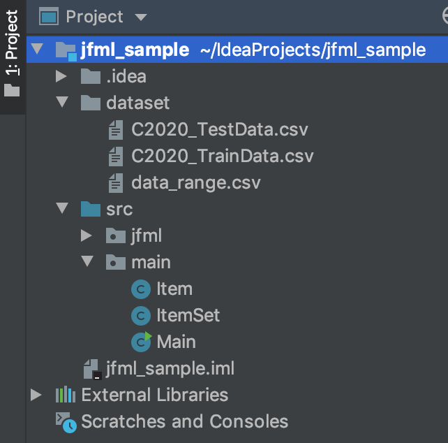

# JFML2020 Sample Code

This is an Eclipse project providing sample code for a  JFML competition.
 _[FML-based Machine Learning Competition for Human and Smart Machine Co-Learning on Game of Go @ WCCI2020](http://oase.nutn.edu.tw/wcci2020-fmlcompetition/overview.php)_.

The sample package is placed at "src/main". The "jfml" package is the original package of the _[JFML library](https://www.uco.es/JFML/)_. You can execute a sample with the sample package and the original JFML library.

The simplest way to run the code is to download or clone "[FML_Competition2020](https://github.com/CI-labo-OPU/FML_Competition2020.git)" and open the folder "jfml2020_sample" from Eclipse.

The package Explore in Eclipse will be as follows:

Eclipse can be downloaded from [here](https://www.eclipse.org).

You can also use IntelliJ IDEA which can be downloaded from [here](https://www.jetbrains.com/idea/). You should copy "[dataset](https://github.com/CI-labo-OPU/FML_Competition2020/tree/master/jfml2020_sample/dataset)" and "[src](https://github.com/CI-labo-OPU/FML_Competition2020/tree/master/jfml2020_sample/src)" to the project in IntelliJ IDEA so that it looks like:

## About the sample package
This package includes three Java source codes as follows:
 + Item.java
 + ItemSet.java
 + Main.java

"Item.java" and "ItemSet.java" are the dataset implementations for this competition.
"Main.java" is a sample main procedure of designing the fuzzy inference model based on JFML library.
In the sample model, only two triangular membership functions "small" and "large" are used for each attribute. The sample model is composed of a large number of rules which are all the combinations of two membership functions for 12 attributes. The antecedent part of each rule is fixed, while its consequent part is tuned by the training data. 

You can execute the "Main.java" with no arguments on Eclipse, or you can export the main function in "Main.java" to JAR file and execute the JAR file.

Once your execute the "Main.java", the mean square errors for the training data and test data are shown in the console:

    Training: MSE = 0.05370033
        Test: MSE = 0.09745144

This result is for Task 1. By refreshing the package, you will find the result files named "EBWR\_H2\_ite100\_train.csv" and "EBWR\_H2\_ite100\_test.csv" together with the xml file named "FML_EBWR.xml".

To obtain the result for Task 2, you have to comment out the 69th line of "Main.java" and uncomment the 70th line.

    // static String outputName = "EBWR";   // Task 1
    static String outputName = "DBWR_next";    // Task 2

Then, please execute again. You will obtain the following result for Task 2.

    Training: MSE = 0.0010160558
        Test: MSE = 7.531748E-4

The generated result files and xml file have different file names from Task 1. 

If you use this sample for competition, please cite 

    https://github.com/CI-labo-OPU/FML_Competition2020/tree/master/jfml2020_sample 

Enjoy!

### Known problems
* JFML does not properly work on Java 11. Java 8 is recommended. 
